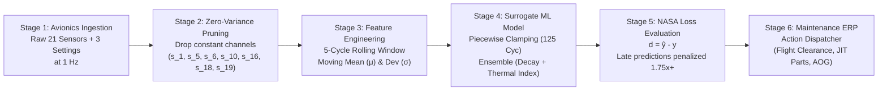

# NASA C-MAPSS Turbofan Engine Predictive Maintenance (PdM) & Digital Twin

[](https://nextjs.org/)
[](https://react.dev/)
[](https://www.typescriptlang.org/)
[](https://tailwindcss.com/)
[](https://opensource.org/licenses/MIT)

> An aerospace-grade, interactive Digital Twin and condition-based predictive maintenance dashboard for commercial turbofan jet engines based on the **NASA C-MAPSS FD001 benchmark**. Features physics-informed Remaining Useful Life (RUL) estimation, NASA asymmetric safety loss auditing, real-time "what-if" fault injection, and automated maintenance ERP dispatching.

---

## 🎯 Executive Problem: Why This Project Is Needed

In commercial aviation, high-bypass turbofan jet engines (e.g., GE90, CFM56, Trent 700) are the single highest-value component on an aircraft, costing between **$15M to $30M per engine**. 

Traditional airline operations still rely on **calendar-based or fixed-hour overhauls** (e.g., pulling engines every 5,000 flight hours). This practice introduces two severe failure modes:

1. **Unnecessary Overhauls:** Pulling healthy engines prematurely costs airlines over **$450,000 per event** in wasted shop inspections and route downtime.
2. **Catastrophic Unscheduled Removals:** Micro-fissures and High-Pressure Compressor (HPC) tip blade erosion can accelerate unexpectedly between scheduled intervals, causing In-Flight Shutdowns (IFSD) or uncontained rotor bursts.
3. **The Aviation Data Paradox:** Under FAA/EASA airworthiness regulations, **passenger aircraft are never permitted to fly to failure**. Consequently, collecting real-world run-to-failure telemetry on active airline fleets is impossible. 

**This platform bridges the gap** between NASA's gold-standard run-to-failure physics simulation and live operational airline decision-making.

---

## 💡 Core Novelty & Unique Technical Contributions

### 1. Physics-Informed Aerothermal Surrogate (Beyond Black-Box ML)
Unlike naive machine learning demos that treat sensors as detached statistical columns, this system models the **thermodynamic causality** of turbofan degradation:
* **HPC Blade Tip Clearance Erosion:** Directly tracked via static compressor discharge pressure ($s_{11}$ / $\text{Ps30}$). As blade clearance widens, static pressure drops precipitously.
* **Compressor Efficiency Loss:** Causes HPC discharge temperature ($s_3$ / $\text{T30}$) and LPT outlet temperature ($s_4$ / $\text{T50}$) to climb due to aerodynamic rubbing and fouling.
* **Coupled Fuel Compensation:** The Full Authority Digital Engine Control (FADEC) automatically injects more fuel ($s_{12}$ / $\phi$) to sustain demanded takeoff thrust, creating further thermal stress.

The engine calculates a composite degradation factor $\Delta_{\text{deg}}$ weighted by aerothermal significance:
$$\Delta_{\text{deg}} = 0.35 \cdot \Delta \text{Ps30} + 0.30 \cdot \Delta \text{T30} + 0.20 \cdot \Delta \text{T50} + 0.15 \cdot \Delta \phi$$

### 2. NASA Asymmetric Loss Scoring (Safety-Biased Evaluation)
Standard machine learning models optimize for symmetric loss functions like **Root Mean Squared Error (RMSE)**. In aviation, **symmetric loss is dangerously flawed**:
* Predicting failure **10 cycles early** ($d = -10$): Causes a premature inspection—inconvenient, but **100% safe**.
* Predicting failure **10 cycles late** ($d = +10$): Dispatches an engine nearing catastrophic failure onto a long-haul route—**catastrophically dangerous**.

This dashboard implements and visually audits the official **NASA Asymmetric Scoring Function**:
$$S = \sum_{i=1}^{N} s_i, \quad s_i = \begin{cases} \exp\left(-\frac{d_i}{13}\right) - 1 & \text{for } d_i < 0 \text{ (Early)} \\ \exp\left(\frac{d_i}{10}\right) - 1 & \text{for } d_i \ge 0 \text{ (Late)} \end{cases}$$
*(where $d_i = \hat{y}_i - y_i$ is prediction error).*

> **At an error of $d = \pm 20$ cycles, the late prediction penalty is $1.75\times$ more severe than an early prediction**, enforcing an engineered conservative bias.

### 3. Piecewise Linear RUL Target (125-Cycle Clamping)
Following Heimes (2008) and NASA guidelines, healthy engines show negligible degradation in early flight hours. Differentiating between an engine with 250 cycles remaining vs. 200 cycles remaining is uninformative noise. 

The system implements a **piecewise linear target clamped at 125 cycles**:
$$\text{RUL}_{\text{true}}(t) = \min\left(125, \, \text{MaxCycle} - t\right)$$
Wear onset accelerates beyond the **Knee Point** ($\sim \text{Cycle } 55\text{--}85$), transitioning from flat nominal health into power-law wear trajectories.

### 4. Interactive Counterfactual "What-If" Fault Injection
Engineers can override live sensors via real-time sliders (injecting sudden compressor pressure drops or turbine temperature spikes) to instantly observe:
* How the surrogate RUL gauge responds.
* When automated clearance drops from `UNRESTRICTED` to `AOG (GROUNDED)`.
* How the turbofan mechanical cross-section maps thermal hotspots in real time.

### 5. Automated ERP Maintenance Dispatcher
Rather than presenting raw numbers, the platform converts ML telemetry into **concrete airline business actions**:
* **$RUL > 50$ (NOMINAL):** Cleared for unrestricted long-haul flight operations; routine A-Check.
* **$20 < RUL \le 50$ (WARNING):** Restrict to domestic short-haul routes; stage Just-In-Time (JIT) HPC blade kits (SKU: `HPC-BLD-STG3-5-TI`).
* **$RUL \le 20$ (CRITICAL):** Immediate **AOG (Aircraft On Ground)** dispatch; emergency shop visit and engine drop.

---

## 📊 The NASA C-MAPSS FD001 Dataset

The **Commercial Modular Aero-Propulsion System Simulation (C-MAPSS)** dataset represents 100 run-to-failure turbofan engines operating under steady-state sea-level conditions (Altitude = 0 ft, Mach = 0.00, TRA = 100°).

### Sensor Dimensionality & Zero-Variance Pruning
Under single sea-level operating conditions, **7 sensors exhibit zero variance** and are pruned to eliminate collinear instability:

| Sensor | Tag | Physical Description | Units | Status |
|:---:|:---:|:---|:---:|:---:|
| $s_1$ | T2 | Total Temperature at Fan Inlet | °R | ❌ Pruned (Zero Variance) |
| **$s_2$** | **T24** | **LPC Outlet Temperature** | **°R** | **✅ Active (~642 K)** |
| **$s_3$** | **T30** | **HPC Outlet Temperature** | **°R** | **✅ Active (~1575 K)** |
| **$s_4$** | **T50** | **LPT Outlet Temperature** | **°R** | **✅ Active (~1395 K)** |
| $s_5$ | P2 | Pressure at Fan Inlet | psia | ❌ Pruned (Zero Variance) |
| $s_6$ | P15 | Total Pressure in Bypass-Duct | psia | ❌ Pruned (Zero Variance) |
| $s_7$ | P30 | Total Pressure at HPC Outlet | psia | ✅ Active |
| $s_8$ | Nf | Physical Fan Speed | rpm | ✅ Active |
| $s_9$ | Nc | Physical Core Speed | rpm | ✅ Active |
| $s_{10}$ | epr | Engine Pressure Ratio | — | ❌ Pruned (Zero Variance) |
| **$s_{11}$** | **Ps30** | **Static Pressure at HPC Outlet** | **psia** | **✅ Primary Predictor (36% Importance)** |
| **$s_{12}$** | **$\phi$** | **Fuel Flow to Static Pressure Ratio** | **pps/psia**| **✅ Active (~518)** |
| $s_{13}$ | NRf | Corrected Fan Speed | rpm | ✅ Active |
| $s_{14}$ | NRc | Corrected Core Speed | rpm | ✅ Active |
| $s_{15}$ | BPR | Bypass Ratio | — | ✅ Active |
| $s_{16}$ | farB | Burner Fuel-Air Ratio | — | ❌ Pruned (Zero Variance) |
| $s_{17}$ | htBleed | Bleed Enthalpy | BTU/s | ✅ Active |
| $s_{18}$ | Nf_dmd | Demanded Fan Speed | rpm | ❌ Pruned (Zero Variance) |
| $s_{19}$ | PCNfR_dmd | Demanded Corrected Fan Speed | rpm | ❌ Pruned (Zero Variance) |
| $s_{20}$ | W31 | HPT Coolant Bleed | lbm/s | ✅ Active |
| $s_{21}$ | W32 | LPT Coolant Bleed | lbm/s | ✅ Active |

---

## 🏗️ Architecture & Data Pipeline Flow



---

## 🖥️ Screen-by-Screen Capabilities

### Screen 1: Fleet Overview & Analytics
* **Fleet KPI Counter Cards:** Total active fleet (100 units), fleet-wide average health index, critical engines requiring immediate attention ($RUL \le 20$), and scheduled service units ($21\text{--}50$).
* **Filterable & Searchable Grid:** Search by Unit ID, Tail Number, Airline, or Aircraft Model with real-time status badges.
* **RUL Distribution Histogram:** Visual brackets categorizing engine wear across operational lifespans.

### Screen 2: Real-Time Digital Twin & Flight Simulator
* **Interactive Flight Cycle Scrubber:** Scrub any of 100 engines from cycle 1 to failure.
* **Live Telemetry Playback:** Real-time clock advancing cycles at $1\times, 2\times,$ or $5\times$ speed.
* **Circular RUL Speedometer Gauge:** Dynamic color transition (green $\to$ amber $\to$ red) with live error delta ($d = \hat{y} - y$) and NASA penalty calculation.
* **Turbofan Component Hotspot Schematic:** 7-stage diagram (Fan, LPC, HPC, Combustor, HPT, LPT, Nozzle) showing aerothermal stress zones.
* **Sensor Degradation Time-Series:** Recharts multi-sensor overlay with 5-cycle rolling averages, knee-point indicator, and critical threshold lines.

### Screen 3: ML Architecture & Model Explainability
* **Interactive 6-Stage Pipeline Flow:** Clickable node modals detailing mathematical equations, inputs, outputs, and implementation code.
* **Feature Importance Ranking:** Visualizes why Static HPC Pressure (`s_11`, 36%) and LPT Temp (`s_4`, 27%) dominate degradation predictions.
* **NASA vs. MSE Loss Comparator:** Interactive error slider ($-30$ to $+30$ cycles) demonstrating exponential late-prediction penalties versus symmetric RMSE.

---

## 🛠️ Tech Stack

* **Framework:** [Next.js 15.2.0](https://nextjs.org/) (App Router, Static Export)
* **Library:** [React 19](https://react.dev/)
* **Language:** [TypeScript 5.7](https://www.typescriptlang.org/)
* **Styling:** [Tailwind CSS v4](https://tailwindcss.com/)
* **Charts & Visualization:** [Recharts 2.15](https://recharts.org/)
* **Icons:** [Lucide React](https://lucide.dev/)

---

## 🚀 Getting Started

### Local Development

1. **Clone the repository:**
   ```bash
   git clone https://github.com/Suksha128/nasa_turbofan.git
   cd nasa_turbofan
   ```

2. **Install dependencies:**
   ```bash
   npm install --legacy-peer-deps
   ```

3. **Run the development server:**
   ```bash
   npm run dev
   ```
   Open [http://localhost:3000](http://localhost:3000) in your browser.

4. **Run automated domain tests:**
   ```bash
   node scripts/test-math.js
   ```

---

## 🌐 Deployment

### GitHub Pages (Automated via GitHub Actions)
1. Go to repository **Settings** $\to$ **Pages**.
2. Under **Build and deployment** $\to$ **Source**, choose:
   * **Deploy from a branch** $\to$ Select `gh-pages` branch, `/ (root)` folder.
3. Every push to `main` automatically builds and updates the live site.

### Netlify
1. Connect this repository to [Netlify](https://app.netlify.com).
2. The included [`netlify.toml`](./netlify.toml) automatically sets:
   * **Build command:** `npm run build`
   * **Publish directory:** `out`

---

## 📄 References & Benchmark Literature
* Saxena, A., Goebel, K., Simon, D., & Eklund, N. (2008). *Damage propagation modeling for aircraft engine run-to-failure simulation*. 2008 IEEE Conference on Prognostics and Health Management.
* Heimes, F. O. (2008). *Recurrent neural networks for remaining useful life estimation*. 2008 International Conference on Prognostics and Health Management.
* NASA Prognostics Data Repository: Commercial Modular Aero-Propulsion System Simulation (C-MAPSS) Dataset.